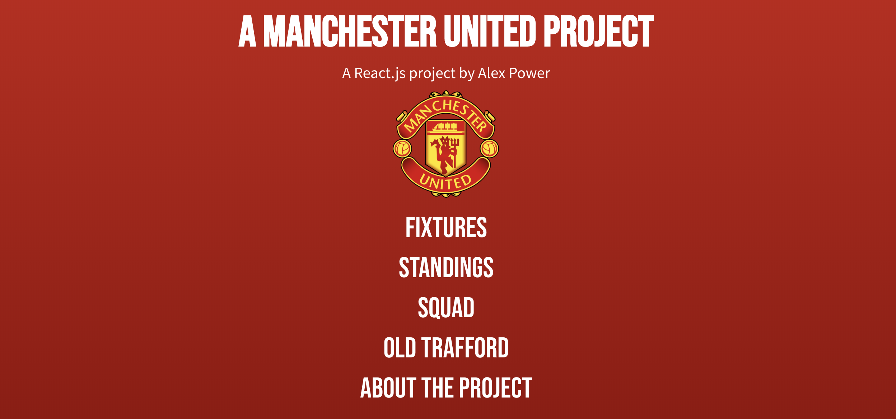
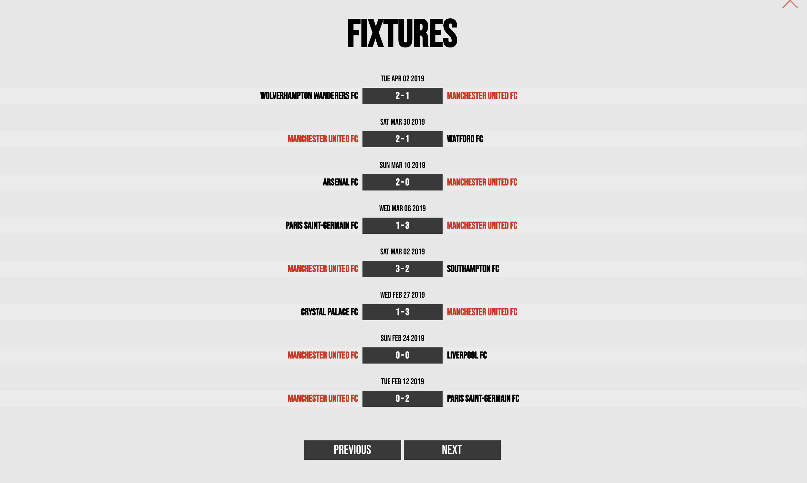
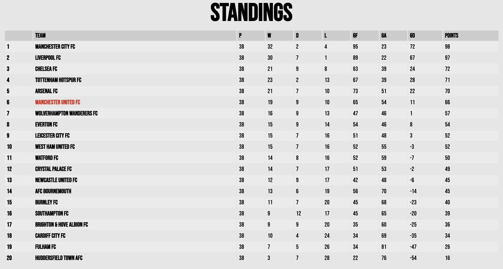
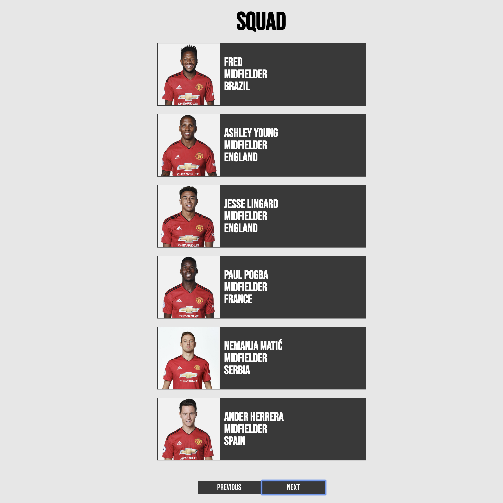
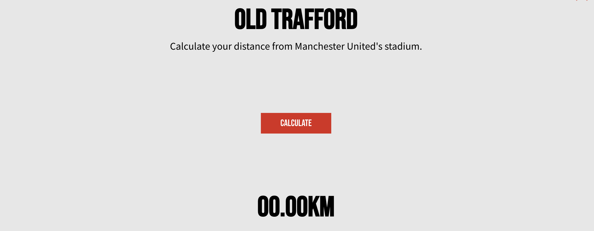

# Manchester United Project



The objective of this project is to develop skills working with React, JavaScript, JSON and REST APIs. This is an ongoing project.

The external API used in this project is https://www.football-data.org.

### Features

#### Fixtures - RESTful API



The 'Standings' feature shows fixtures and results for the current Premier League season. Data is received via an axios GET request to https://www.football-data.org.

The data for each match is converted and formatted so that it can displayed in a user-friendly manner. For example, date is received in UTC format and converted to a plain string:

```javascript
// Input: "2019-05-02T15:00:00Z"
let date = new Date(current.utcDate);
let hours = date
  .getUTCHours()
  .toString()
  .padStart(2, "0");
let minutes = date
  .getUTCMinutes()
  .toString()
  .padStart(2, "0");
score = hours + ":" + minutes;
// Output: "15:00"
```

The data for each match is stored in an object and passed into a component as props.

#### Standings - RESTful API



The 'Standings' feature shows the current Premier League table. Data is received via axios from a RESTful API (https://www.football-data.org/) as an array of objects. This is subsequently converted into an HTML table using the Map function.

For responsive design purposes, I also make use of the Window's resize event on componentWillUnmount, in order to conditionally display or hide certain table elements.

At a later stage I intend to extend the functionality of this feature to allow users to select and view tables by season.

#### Players - RESTful API and Local Data File



As before, data is pulled from the API and passed to components as props.

I wanted to include player pictures, but as this is not supported by the API, I created a local data source. The local data source is compared with the data received from the API, and displays the correct image accordingly, if available.

I am looking for a more effective solution to this issue. If you might be able to assist feel free to reach out.

The same pagination component is reused, too.

#### Old Trafford - Geolocation



The 'Old Trafford' feature requests the user's location and determines the user's distance from Manchester United's stadium, Old Trafford.

The distance is determined via a JavaScript function making use of the Haversine formula (calculates the great-circle distance between two points on a sphere given their longitudes and latitudes).

#### Pagination


Pagination is applied to both the Fixtures and Players components. Number of pages is calculated with selected number per page and number of results received from the API.

Button is either disabled or enabled depending on the current page.
